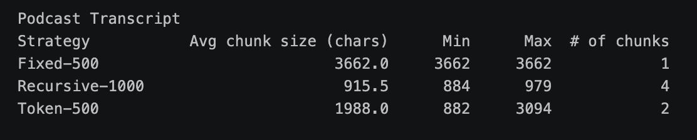
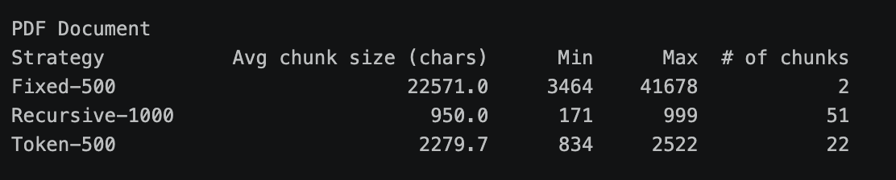
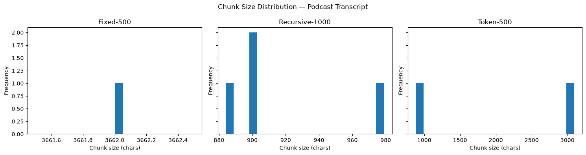
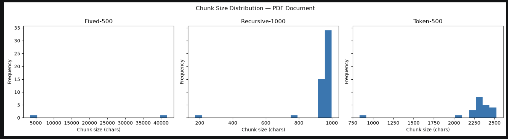
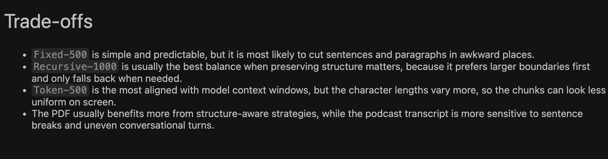
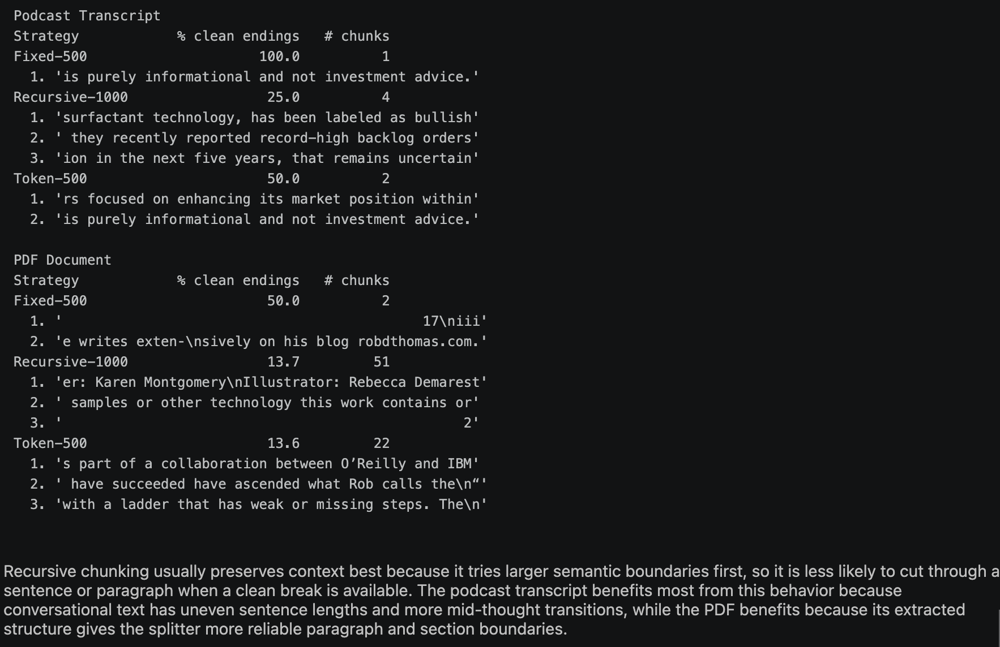
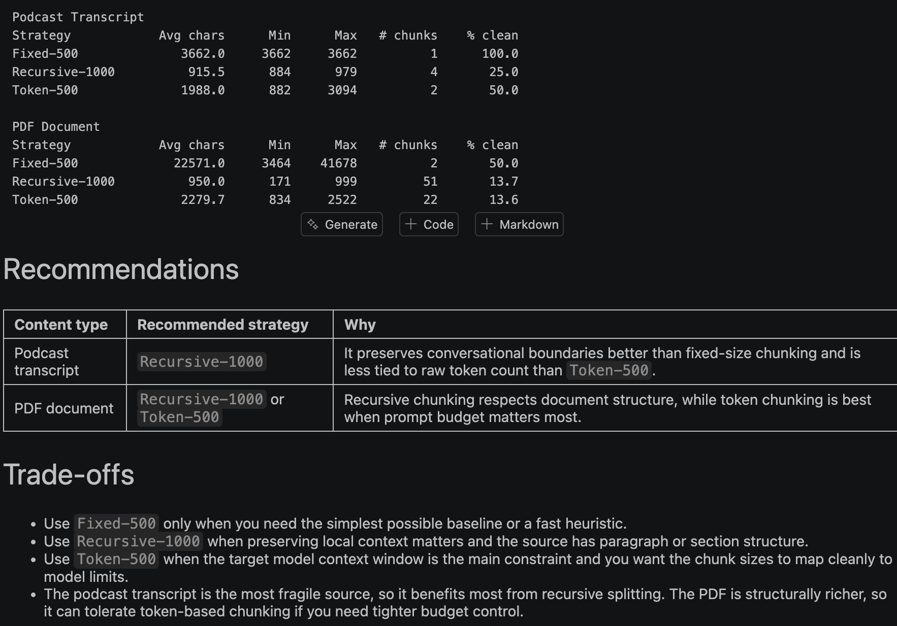

Author: Mudit Airan
Description: Build and evaluate different Ways to Chunk Podcast and PDF path and prove the answer is grounded in inspectable evidence.

I used the pdf and podcast (generated in the project in week 2) saved in the data folder - 
podcast -  data/CVX_manufacturing_podcast.mp3
pdf - data/The AI Ladder.pdf

Fixed size chunking - fixed_size_chunking_analysis.md
Recursive character chunking - recursive_character_chunking_analysis.md
Token based chunking - token_based_chunking_analysis.md

Step 6 Comparison table of podcast - 
Step 6 Comparison table of pdf - 
Step 6 chunk distribution podcast - 
Step 6 chunk distribution pdf - 
Step 6 trade offs - 

Step 7 - Recursive chunking - 

Step 8 - Recommendations -  also in /Users/muditairan/Desktop/Week3-Day3/slice-google-docs/chunking_recommendations.md

